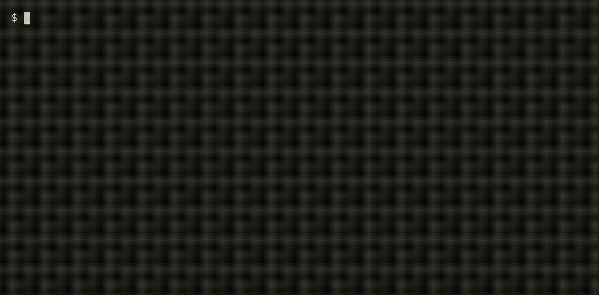

# keepass-diff

This CLI-tool diffs two Keepass (.kdbx) files and prints their differences.

Usage:

```
cargo run <file-a> <file-b>
```

The CLI will ask for the password for both files individually.



You can also provide one or both passwords on the command line (please be aware
that this will expose them to other users logged on to the system):

```
cargo run -- <file-a> <file-b> --password-a <password-a> --password-b <password-b>
```

(the -- is necessary for cargo to pass the arguments through to keepass-diff)

If the files have the same password, you can use the `--password <password>` 
flag. Be aware this has the same problem as above:

```
cargo run -- <file-a> <file-b> --password <password>
```

## Used libraries:

* [clap](https://clap.rs/) to read command line arguments
* [rpassword](https://github.com/conradkdotcom/rpassword) to read the passwords.
* [keepass](https://github.com/sseemayer/keepass-rs) to read `.kdbx` files.
* [termcolor](https://github.com/BurntSushi/termcolor) to print with colors.

Password for the Keepass demo files: `demopass`

## Contributing

Care to help? I'm pretty new to Rust, so if anyone likes to help or teach me 
cool stuff, please reach out!
