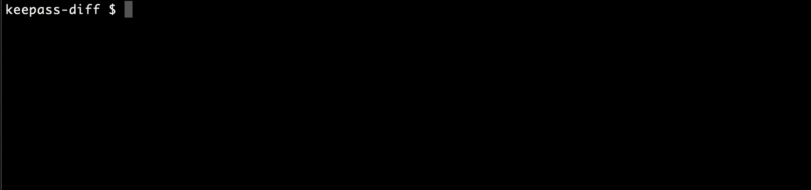

<p align="center" style="text-align: center;">
  
</p>

This CLI-tool diffs two Keepass (.kdbx) files and prints their differences.

## Installation

The main installation method is through Rust.

```
RUSTFLAGS="-C target-cpu=native" cargo install keepass-diff
```

The `RUSTFLAGS` variable will significantly boost performance. See
[installation note in keepass-rs](https://github.com/sseemayer/keepass-rs#installation).

### Alternative installation and usage using a container

If you don't have the Rust toolchain installed, there is an alternative installation method using containers. There are two installation steps necessary to be able to run `keepass-diff` in your current working directory with a simple command:

1. Build the container
2. Set up an alias for simple usage

The following commands assume `docker` for building and running the container, but it should be possible to replace it with `podman` and maybe other engines. Please check whether the options are available.

To build the container, run:

```
docker build -f Containerfile.install -t "keepass-diff:custom-local" .
```

To get the correct alias for your machine to use, run:

```
alias keepass-diff='docker run -it --rm -v "$(pwd)":/app:ro "keepass-diff:custom-local"'
```

The `alias` command can be copy and pasted into your `.bashrc` or `.zshrc` file. This will make sure to have keepass-diff available whenever you start a new terminal session. Either start a new shell or run the command in the current terminal once to make it available right away.

With the alias being set up, `keepass-diff` should be available. Try running:

```
keepass-diff --help
```

**Note:** Keep in mind that the alias is set up in a way to allow the current working directory being mounted into the container. That means you're able to access files from this directory, but you won't be able to access files through an absolute path or using `../` from your host machine.

## Usage

```
keepass-diff <file-a> <file-b>
```

The CLI will ask for the password for both files individually.



### Providing passwords

You can also provide one or both passwords on the command line (please be aware
that this will expose them to other users logged on to the system):

```
keepass-diff <file-a> <file-b> --password-a <password-a> --password-b <password-b>
```

If the files have the same password, you can use the `--passwords <password>`
flag. Be aware this has the same problem as above:

```
keepass-diff <file-a> <file-b> --passwords <password>
```

To avoid exposing the password, use `--same-password` instead. The CLI will ask
you to type it once for both files.

```
keepass-diff <file-a> <file-b> --same-password
```

### Providing keyfiles

```
keepass-diff <file-a> <file-b> --keyfile-a <keyfile-a> --keyfile-b <keyfile-b>
```

If one of these flags is provided, it will use the keyfile for authentication.
It will still ask for a password, if the password flags are not provided.

### Disabling color output for scripts

If you want to pipe the output of the command into another file or script, you
may want to disable the terminal colors. You can do so with the `--no-color` or
`-C` option.

`--help` yields:

```
keepass-diff 1.1.4
Joern Bernhardt <joern.bernhardt@googlemail.com>
This CLI-tool reads two Keepass (.kdbx) files and prints their differences.

USAGE:
    keepass-diff [OPTIONS] <INPUT-A> <INPUT-B>

ARGS:
    <INPUT-A>    Sets the first file
    <INPUT-B>    Sets the second file

OPTIONS:
    -C, --no-color                   Disables color output
    -h, --help                       Print help information
        --keyfile-a <keyfile-a>      Sets the key file for the first file
        --keyfile-b <keyfile-b>      Sets the key file for the second file
        --keyfiles <keyfiles>        Sets the same key file for both files (keyfile-a and keyfile-b would take precedence if set as well)
        --no-password-a              Sets no password for the first file (and will not ask for it)
        --no-password-b              Sets no password for the second file (and will not ask for it)
        --no-passwords               Sets no password for both files (and will not ask for both files)
        --password-a <password-a>    Sets the password for the first file (will be asked for if omitted)
        --password-b <password-b>    Sets the password for the second file (will be asked for if omitted)
        --passwords <passwords>      Sets the password for both files (if it's the same for both files)
        --same-password              Asks for password only once, and tries to open both files with it
    -v, --verbose                    Enables verbose output
    -V, --version                    Print version information
```

## Used libraries:

- [clap](https://clap.rs/) to read command line arguments
- [rpassword](https://github.com/conradkdotcom/rpassword) to read the passwords.
- [keepass](https://github.com/sseemayer/keepass-rs) to read `.kdbx` files.
- [termcolor](https://github.com/BurntSushi/termcolor) to print with colors.

## Testing

Password for the Keepass demo files: `demopass`.

`test_file.kdbx` is locked without password and keyfile `keyfile.key`.
`test2_file.kdbx` is locked with `demopass` and the keyfile `keyfile.key`.

A small bash script for running tests is `run-tests.sh`. It will run a few tests
to see if the outputs is correct. Best run as
`RUSTFLAGS="-C target-cpu=native" ./run-tests.sh` for improved performance.

## Contributing

Care to help? I'm pretty new to Rust, so if anyone likes to help or teach me
cool stuff, please reach out!
